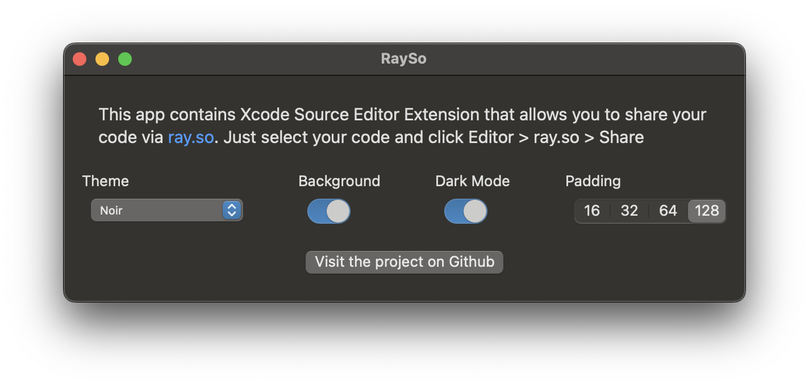
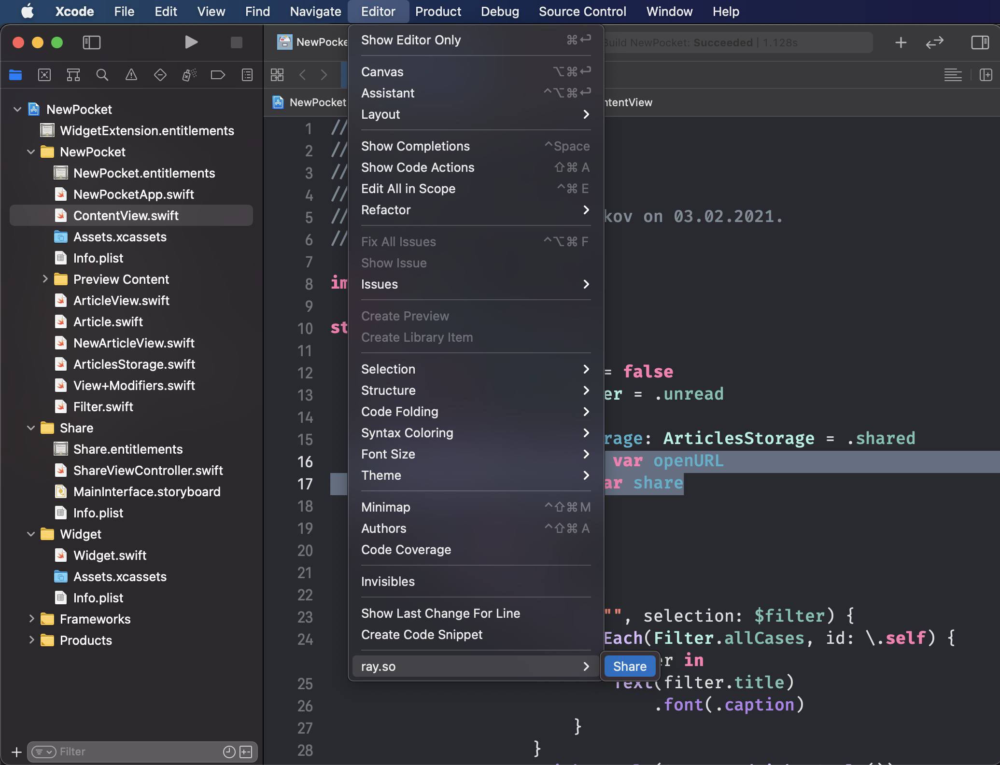
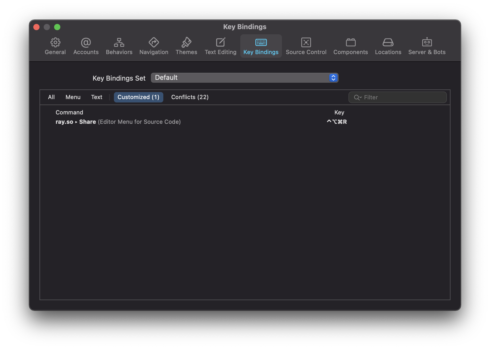

# RaySo

Share your awesome code to [ray.so](https://ray.so) with Xcode Extension. Read about development jorney in [my blog](https://blog.artemnovichkov.com/developing-xcode-extensions-tips-and-tricks).

## 🚀 Installation

1. Clone this repository.
2. Activate your team for signing both the macOS app and the extension.
3. Build the macOS app.
4. Move the built macOS app to your Mac’s Applications folder. You may need to launch the app at least once to register its extension.
5. Relaunch Xcode.

You can check that the extension is installed by going to `System preferences > Extensions > Xcode Source Editor`, and verifying that there's a check next to RaySo.

## ✍️ Usage

Customize sharing parameters in main app:

You can find the Share command in `Xcode > Editor`:

To speed up sharing, you can associate a keyboard shortcut to Share command. Open the shortcuts menu in `Xcode > Preferences... > Key Bindings` and set your command. I use ⌃ + ⌥ + ⌘ + R.

## Author

Artem Novichkov, https://www.artemnovichkov.com/

## License

The project is available under the MIT license. See the [LICENSE](./LICENSE) file for more info.

